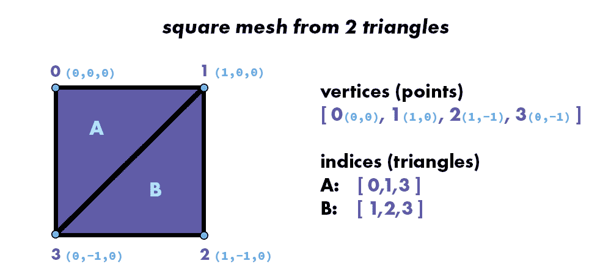
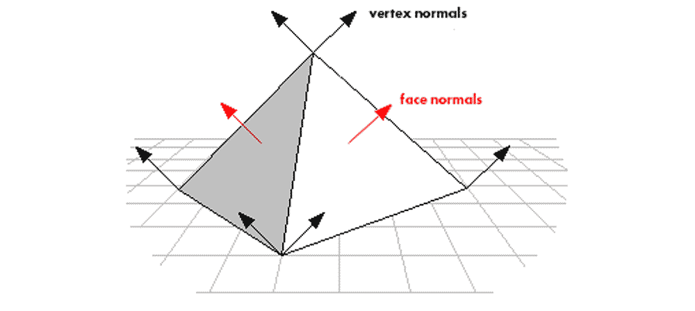
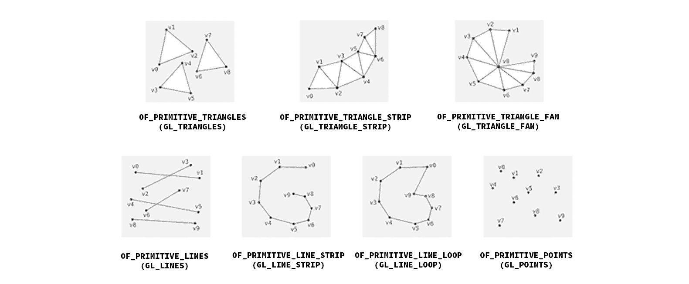

# ComputerGraphics2020

MEDIART 206: Computer Graphics - openFrameworks
Fall Session 2 2020  

Week 06 - Class 11 – Monday November 30th – More about 3D, Meshes + introducing Shaders, Rendering and Advanced Computer Vision (3D data) and start talking about Kinect (Kinect V2).

# UPDATES

**Midterm Proposal** -- Due  ```TODAY```, **BUT** you can submit changes to the proposal until next homework due day.

**Homework (Due Last Friday, come on everyone!):**
 
Create a new (don’t use old homework code or example code from class) open Frameworks application that has the theme “Winter is coming”. This could be literal or figurative. Examples could be a game about the white walkers from Game of Thrones, a story book about the 4 seasons of the year, etc. Make sure you use interactive, animation, OOP (classes) and 3D techniques learned in class.

**Course topics for the rest of the session**

**Course 11** – Monday November 30th – More about 3D, Meshes + introducing Shaders, Rendering and Advanced Computer Vision (3D data) and start talking about Kinect V2.

**Course 12** – Thursday December 2nd – OfXaddons, Text Input, Image Processing + OpenCV/Kinect V2.

**Course 13** – Monday December 7th – More Shaders, Graphics Pipeline, Kinect, Face Tracking (Maybe Arduino)

**Course 14** – Wednesday December 9th - In Class Final Project Workshop and Q/A.

**Final Presentation** – Monday December 14th – Final Presentations and Finals Due.

## Code

 - **3d Model Loader**  - load and modify a 3D model mesh, uses ofxAssimpModelLoader addon, loads OBJ format 3D model (PLY also works)
- **Background Subtraction**  - "remove" the background from an image
- **Blend Modes**  - demos how to use ofBlendMode to achieve image blending
- **Blob Detector**  - detect image regions based on brightness
- **Color Channels** - separate the color channels of an image
- **Mesh Faces** - access and adjust the faces of a mesh
- **Mesh Webcam** - distort the vertices of a textured mesh based on image brightness
- **Pixel Shifter** - glitch-art, shifting locations of pixels in image
- **Pixel Data** - write pixels to memory and create an image from scratch!
- **Glitch** - shift pixels to create glitch effect
- **Mesh Texture** -  draw a sphere mesh with lighting and planet texture
- **OSC Mouse** - send and receive OSC network messages

## Review

### 3D Meshes / `ofMesh`


A **mesh** is a collection of 3D points (_vertices_), connected by lines (a _wireframe_) to form a surface (_faces_).  

In oF, we use **[ofMesh](https://openframeworks.cc/documentation/3d/ofMesh)** to represent a 3D mesh. 

**ofMesh** stores the mesh data in collections, like:

  - **vertices:** the 3D mesh points - `ofMesh::getVertices(); // returns vector<glm::vec3>`
  - **indices:** the connections between points - `ofMesh::getIndices();    // returns vector<int>`

Typically, mesh **vertices** are connected as _triangles_ to form complex surfaces.

**Indices** are listed in groups of 3 to connect vertices into triangles.  
Each **index** refers to a point by its index in the vertices vector, i.e. `index = i --> vertex[i]`.  

_note:  
Indices should be listed in clockwise order when the triangle is seen from the front.  
Triangles have a front (clockwise) and back (counter-clockwise)._



**indices** = [ 0,1,3, 1,2,3 ]


**ofMesh** can also contain more (optional) mesh data -  
**texture coordinates**, and **normals**:  

  - **texture coordinates:** how the mesh surface maps to a 2D image (a **texture**) -  

    `ofMesh::getTexCoords();    // returns vector<glm::vec2>`
    
    One **texture coordinate** per index (so 3 per triangle).  
    Each represents a corresponding 2D position on the image.

    

  - **normals:** how the mesh faces are oriented to reflect light -  

      `ofMesh::getNormals();    // return vector<glm::vec3>` 

    **Normals** are vector lines that stick out from the mesh surface.  
    There is one **normal** per index (so 3 per triangle).
    They are used to calculate 3D lighting effects (when lighting is enabled).

    
    
    ```
      indices are the vertices that form triangles -

          e.g. triangle a,b,c  =>  vertices[a],vertices[b],vertices[c]

          to make a mesh grid:

            1 rectangle   =>        2 triangles

             A-------B          A-------B        B
             |     / |          |     /        / |
             |   /   |    =>    |   /   +    /   |
             | /     |          | /        /     |
             C-------D          C        C-------D

        indices are grouped in threes - a,b,c - clockwise:
        e.g: 0,1,2... 3,4,5... etc  ==> [0,1,2,3,4,5...]
        
    ```

    ```c++
    ofMesh mesh;

    // add 3 vertices
    mesh.addVertex( ofVec3f(0,0,0) );       // vertex index 0
    mesh.addVertex( ofVec3f(100,0,0) );     // vertex index 1
    mesh.addVertex( ofVec3f(0,-100,0) );    // vertex index 3

    // add 3 indices to our indices list to form a triangle:
    mesh.addIndex(0);
    mesh.addIndex(1);
    mesh.addIndex(2);

    // add color tint to our vertices
    mesh.addColor( ofColor::red );      // vertex 0 will be red
    mesh.addColor( ofColor::green);     // vertex 1 will be green
    mesh.addColor( ofColor::blue);      // vertex 2 will be blue

    // add texture coordinates per vertices
    // this is how we will map an image texture to our mesh
    mesh.addTexCoord( ofVec2f(0,0) );       // image(0,0) at vertex index 0
    mesh.addTexCoord( ofVec2f(640,0) );     // image(640,0) at vertex index 1
    mesh.addTexCoord( ofVec2f(0,480) );     // image(0,480) at vertex index 2

    // for working with normals, see Week10/Terrain example...

    ```

_note:  
ofMesh defaults to triangles, but you can set it to use alternate modes:_

```c++

ofMesh mesh;
mesh.setMode(OF_PRIMITIVE_TRIANGLES);    // ofMesh default mode - individual triangles

/* other types:
---------------
OF_PRIMITIVE_TRIANGLES, OF_PRIMITIVE_TRIANGLE_STRIP, OF_PRIMITIVE_TRIANGLE_FAN, 
OF_PRIMITIVE_LINES, OF_PRIMITIVE_LINE_STRIP, OF_PRIMITIVE_LINE_LOOP, OF_PRIMITIVE_POINTS
*/
```
Check out the [ofMesh documentation](https://openframeworks.cc/documentation/3d/ofMesh/) for more info on primitive modes.




## Homework

READ:  [Preliminaries to Image Processing](http://openframeworks.cc/ofBook/chapters/image_processing_computer_vision.html#preliminariestoimageprocessing) section of ofBook.  It explains how pixels are stored in memory & shows how to access and manipulate them.

1.  **Glitchy**
  Load an image or video (e.g. ofImage, ofVideoGrabber, etc.) and alter it through code! You can manipulate the colors, warp the shape using ofMesh, or experiment with your own methods.

2.  **3D World**  
  Create a 3D scene using ofEasyCam, and place objects around your space.  
  You can use primitive 3D shapes like ofBoxPrimitive, or use ofMesh.  
  Animate your world with motion and color (and lighting if you wish).


### KINECT V2

Check out and read up about the Kinect V2 add-on and how to install it on Mac and Windows: [ofxKinectV2](https://github.com/ofTheo/ofxKinectV2). We are using th ```Kinect for X-Box (V2)``` Model 1520. We will dig deep into it next class. You can check out a Kinect V2 from the Media & Arts cage.

### Kinect V2 Tutorials

**We will go over this code next class:**

Lewis Lepton

[openFrameworks Tutorial Series - Episode 035 - ofxKinectV2](https://www.youtube.com/watch?v=yeBcKppa9UM)

[openFrameworks Tutorial Series - Episode 036 - ofxKinectV2 haar](https://youtu.be/YCduMQTZq_w)

Dan Buzzo

[Kinect2 Natural Interaction Skeleton Tracking Tutorial in openFrameworks: Part 01](https://www.youtube.com/watch?v=HF74L-DvCUE)

[Kinect2 Natural Interaction Skeleton Tracking Tutorial in openFrameworks: Part 02](https://www.youtube.com/watch?v=Hn_onMOUcno)

You will need to install [LibFreenect2](https://github.com/OpenKinect/libfreenect2/) AND [ofxNI2](https://github.com/roymacdonald/ofxNI2 ) to get this working. Follow the instructions on the GitHub page. 

